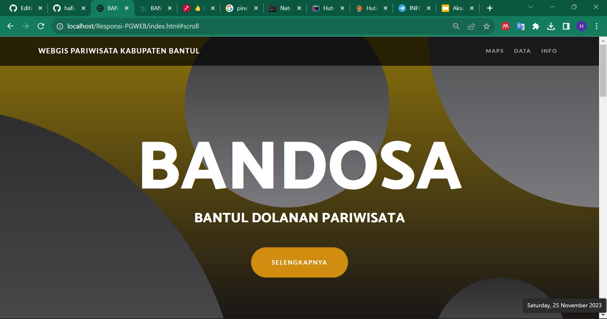
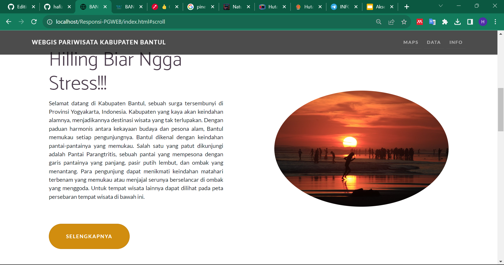
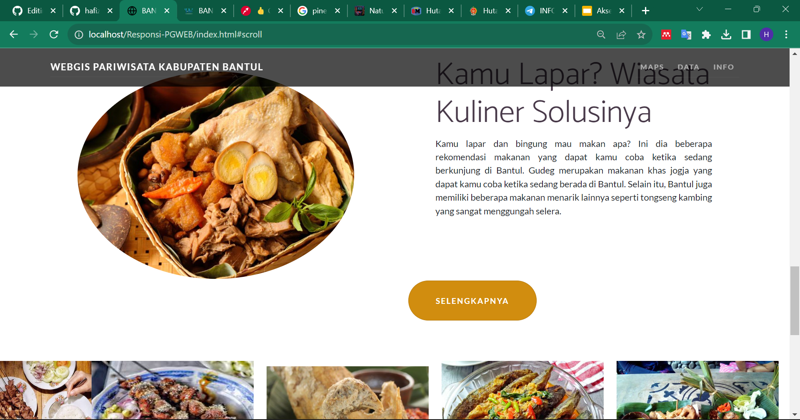
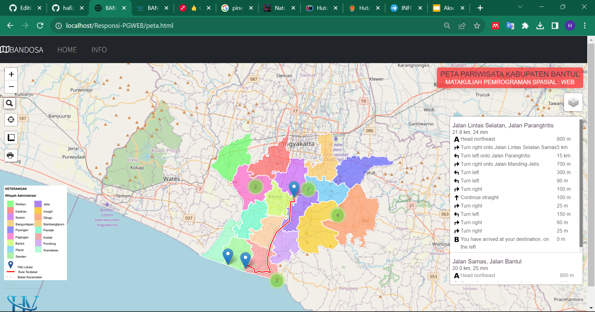
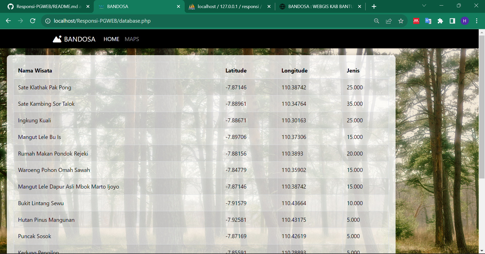
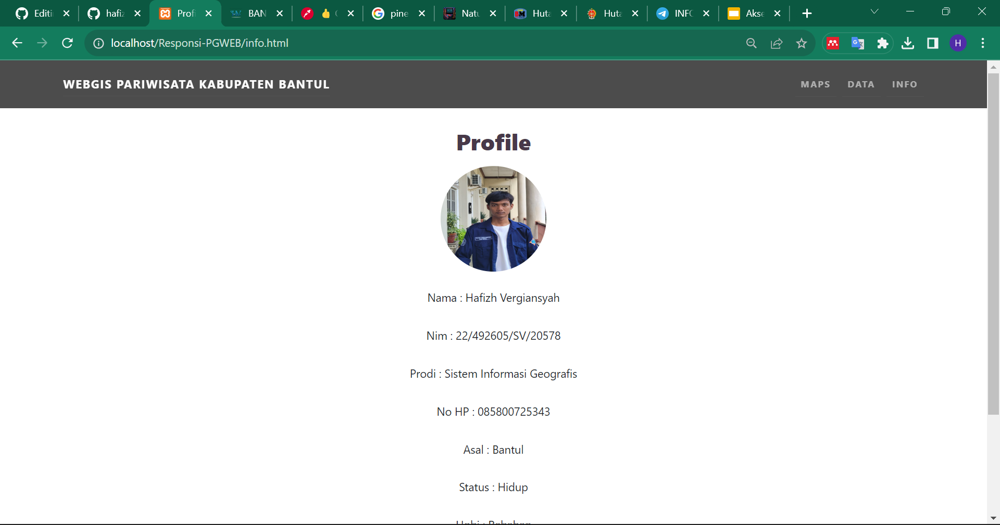

# Responsi-PGWEB

<h2>Nama Produk : BANDOSA (Bantul Dolanan Pariwisata)</h2>

<h2>Deskripsi singkat</h2>
Kabupaten Bantul merupakan salah satu kabupaten yang terletak di Daerah Istimewa Yogyakarta. Kabupaten Bantul kaya akan
keindahan alamnya, menjadikannya destinasi wisata yang tak
terlupakan. BANDOSA merupakan WEBGIS yang memuat tentang info mengenai tempat wisata alam maupun wisata kuliner yang terdapat di Bantul.

<h2>Komponen pembangun produk: </h2>
<ul>
<li>Leaflet JS: menampilkan peta dalam web yang dilengkapi dengan berbagai fitur serta plugin
</li>
<li>Bootstrap: mengatur layout UI pada web</li>
<li>GeoJson: data spasial yang ditampilkan pada web</li>
<li>PHPMyAdmin: pembuatan dan pengolahan database</li>
</ul>

<h2>Sumber data:</h2>
<ul>
<li> Data shapefile wilayah administrasi Bantul dari InaGeoPortal</li>
<li>Titik lokasi wisata dari Google Maps</li>
</ul>

<h2>Tangkapan layar komponen penting produk:</h2>
<ul>
  <li>Landing page</li>  
   
   
   <li>Peta persebaran pariwisata</li>  
   <li>Tabel</li>  
<li>Profil</li>  
</ul>

link demo : "https://hafizhvergiansyah.github.io/Responsi-PGWEB/index.html"
